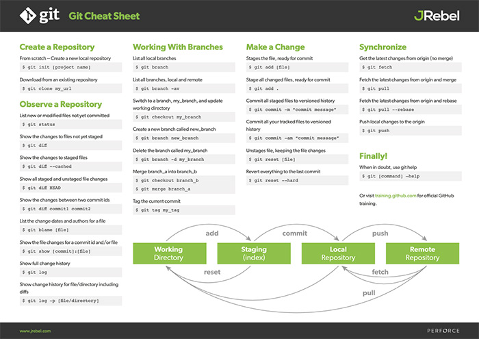

# Welcome to The Cemetery of Culture.

## About this Repository
### Introduction
This repository was created with the intention of keeping track of all the files that I create over the course of my B.Tech in Computer Science & Engg. specialising in AI/ML.

Contributors are most welcome to fork and create pull requests. The rest of the `README.md` file will talk about how to get started forking the repo and making a pull request.

### Ideal use
To make the most of this repository, keep in mind the aforementioned objective of this repo, namely, to improve everyone's version control skills and to become better programmers in a team.

To that end, the ideal method to use this repository is to contribute code to it on a daily basis by issuing pull requests from each forked repository. This will assist us in adhering to a collaborative file structure and, in the end, will provide us with the skills required to objectively take notes and/or critique a peer's code.

### Note to the contributors
**Though everyone is a contributor, to maintain a uniform quality and file structure among the various sub-directories we have in this repo, please wait for the PRs to be accepted only by @0xVolt.**

----------

## Introduction to version control with Git - working with Git's CLI
Here's a really effective cheat sheet to help understand flow of the git process of pushing code.

*Note: Make sure when dealing with images and markdown files, always - and I mean **ALWAYS** - use relative paths that begin with `./`.*

###### What follows is the steps to successfully collaborate on a GitHub repo for any beginner to Git and GitHub.

## How to contribute?
### Forking the repo
The first thing you need to do to be able to contribute to this repo, is to fork this repo. To do this, navigate to the top right of your screen to where it says `fork` and hit the button.

This will prompt you to create a forked repo that is owned by you and not by any one else.

### Updating forked repo
Updating the forked repo is just like updating any other repo on GitHub using Git.

- First clone the repo by copying its link and using the CLI.
    - To copy its link, navigate to the home page of your repo *(Where its README file is displayed)* and find the `Code` button. Click the button and copy the first link you see.
    - Navigate to your Git bash and type in:
    `git clone <the_link_you_copied>`
    - Once the repo is cloned, a copy of the entire repo will be located as a folder on your computer in the same directory in which the bash was open.

- Once you've added files into that folder, you need the changes made on your computer to reflect in the repo on GitHub. To do this, execute the following commands:

    1. `git add .`
        - `git add` adds files to the tracked list to be committed and then pushed, and the argument it takes is `.` which adds all the currently untracked files into your staging area.
    2. `git commit -m "<your_commit_message_here>"`
        - `git commit` adds those files in the staging area as 'files to be committed' to the repo. The argument it takes is `-m` - which stands for message - and then the message that gives another collaborator information on what the files committed do.
        - Its important to note that you cannot commit without a message. Its just best practice to give meaningful messages in your commits.
    3. `git push`
        - This pushes all the files which were tracked as committed files in the previous step and is the final step to push your files to GitHub for the world (or collaborators to see).

- After you're satisfied with all the changes you've made to your forked repo, you then need to update the main repo from which you forked your repo.
    - You do this by creating a pull request (PR for short).
    - To do this, navigate to the GitHub page of the main repo and select the pull requests tab.
    - Then create a new pull request and enter a meaningful message like we did for commits.
    - After that, just sit tight and wait for a moderator or the repo owner to accept your PR and merge your code with the main repos or a comment from the mod/owner explaining why they didn't approve your PR.

###### Note: If there are any errors in creating a pull request, read the next para to sync changes in the main repo with your forked one.

### Syncing your forked repo
##### Its important to note that before you start working on your forked repo, you want to make sure that your forked repo is up-to-date and is in sync with the main repo.
This is so that you don't step on any toes when you make your changes or you don't make changes and make a PR to find that someone beat you to the punch. You do this by executing the following commands in your Git bash.

###### Pre-requisite step
- `git remote add upstream <parent_github_repo_link>`
    - You get the parent link the same way you got your forked repo link when you cloned it, except you do it on the main/parent repos site.
    - This step is only a one time thing to make sure that you sync your repo w.r.t to the desired repo.

###### Steps
1. `git fetch upstream`
2. `git merge upstream/main` or `git merge upstream/master`

### Resetting commits
- If the commit you want to get rid of was the last commit, and you have not done any additional work you can simply use git-reset

       git reset HEAD^

   Takes your branch back to the commit just before your current HEAD. However, it doesn't actually change the files in your working tree. As a result, the changes that were in that commit show up as modified - its like an 'un-commit' command. In fact, I have an alias to do just that.
- Delete the most recent commit, without destroying the work you've done:

        git reset --soft HEAD~1

    Delete the most recent commit and remove changes:

        git reset --hard HEAD~1

- Change the value after `HEAD~` to revert to how many every commits previous. For example, if you need to revert 8 local commits, use

        git reset --soft HEAD~8

- [Here](https://stackoverflow.com/questions/5097456/throw-away-local-commits-in-git) is an amazing source to learn about reverting local commits. Real lifesaver this one!
------
